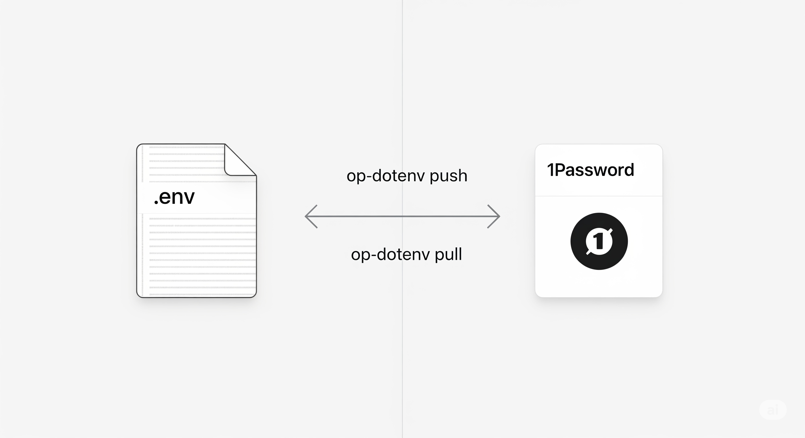
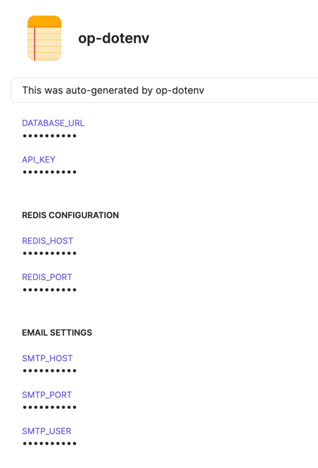

# op-dotenv

[](https://github.com/scriptogre/op-dotenv/releases)
[](https://golang.org/)
[](LICENSE)
[](https://github.com/scriptogre/homebrew-op-dotenv)

Convert .env files to 1Password items and vice versa.



## What it does

- **Push**: Convert `.env` file (in current directory) into an 1Password item
- **Pull**: Convert 1Password item into an `.env` file

**Note:** 1Password item name defaults to current directory name.

## Installation

```bash
brew install scriptogre/op-dotenv
```

## Requirements

- [1Password CLI](https://developer.1password.com/docs/cli/get-started/) installed and authenticated

## Usage

```bash
# Convert .env to 1Password item
op-dotenv push

# Convert 1Password item to .env
op-dotenv pull

# Specify custom file
op-dotenv push .env.production

# Override vault & item name
op-dotenv push --vault MyVault --item MyProject

# Force overwrite without confirmation
op-dotenv push --force

# View current configuration
op-dotenv config

# Clean up configuration data
op-dotenv clean
```

## Format specification

### .env file format

```bash
# --------------------------------------------
# This was auto-generated by op-dotenv
# --------------------------------------------

DATABASE_URL=postgres://localhost:5432/myapp
API_KEY=secret123

# Redis Configuration
REDIS_HOST=localhost
REDIS_PORT=6379

# Email Settings
SMTP_HOST=smtp.gmail.com
SMTP_PORT=587
SMTP_USER=user@example.com
```

### Becomes this 1Password item



And vice-versa.

### Rules

1. Top-level comment surrounded by 44 dashes becomes the item note
2. Variables at the top (before any `# Section Name` comment) are saved in 1Password without a section.
3. Variables after a `# [label]` line in `.env` are saved in a `[label]` section in 1Password.
4. Variables containing `PASSWORD`, `PASS`, `SECRET`, `KEY`, `TOKEN`, `AUTH`, `CREDENTIAL`, `HASH`, or `SALT` are concealed in 1Password. All other variables remain visible as text fields.
5. Pull creates the same format as the original `.env` file

## Configuration

The tool stores vault and item preferences per directory in:
```
~/.config/op-dotenv/config.json
```

**Example configuration output:**
```bash
❯ op-dotenv config
Current configuration for /Users/chris/Projects/op-dotenv:
  Vault: Environments
  Item:  op-dotenv
```

**Clean up configuration:**
```bash
# Remove all stored configuration data
op-dotenv clean
```

This is useful when uninstalling the tool or resetting preferences.

## Note

1Password recently introduced [Environments (beta)](https://developer.1password.com/docs/environments/) which may eventually make this tool obsolete. However, the current beta has limitations and this tool provides a simpler workflow for basic use cases.

## License

MIT